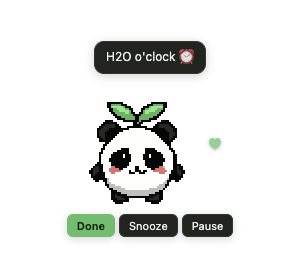
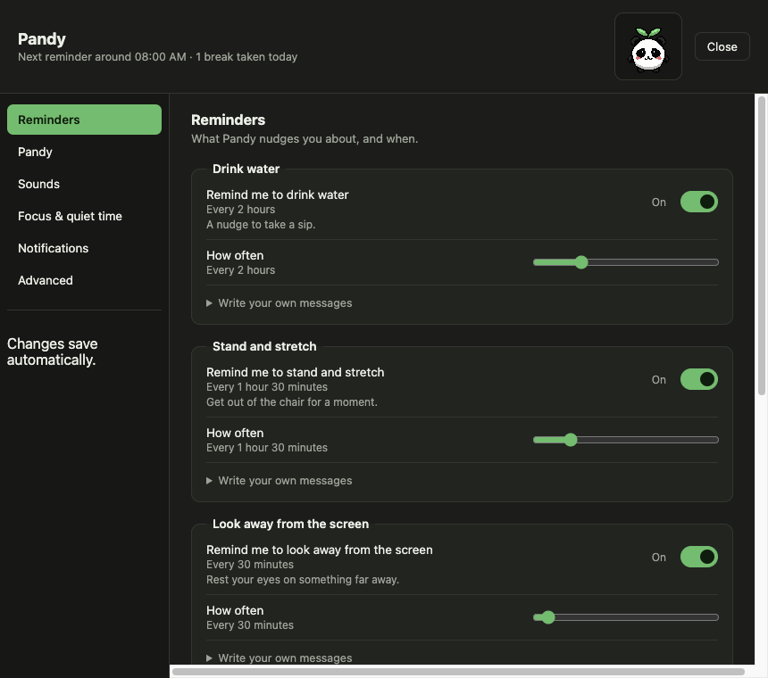

<div align="center">

# 🐼 Pandy

**A cute wellness companion that reminds you to stand, hydrate, look away and touch grass.**

Ships as a **VS Code extension** and an **Electron tray app** with an optional
always-on-top desktop widget — driven by one shared reminder engine.

</div>

---

## What it does

Pandy nudges you gently, on your schedule, with a pixel-art panda:

| Reminder | Default interval |
|---|---|
| 💧 Drink water | every 2 hours |
| 🧍 Stand and stretch | every 90 minutes |
| 👀 Look away from the screen | every 30 minutes |
| 🌱 Touch grass | every 4 hours |

Quiet hours default to 8 PM – 8 AM, sound is **off** by default, and timing is
randomised by ±5 minutes so it never feels mechanical.

**Pandy never guilts you.** No shame, no streak threats, no medical claims —
just a panda who thinks you should drink some water.

## What it looks like

<table>
<tr>
<td align="center"><br><sub>Idle widget</sub></td>
<td align="center"><br><sub>A reminder</sub></td>
</tr>
</table>



These are captured by the app itself via `--pandy-capture`, which walks the real
firing path and screenshots its own window — so they cannot drift from what
Pandy actually renders.

## Principles

- **Offline, always.** No accounts, no backend, no cloud sync, no AI APIs, no
  database, no telemetry. Nothing leaves your machine.
- **No backlog.** Close your laptop for three hours and you will not be greeted
  by a stack of missed reminders — at most one fires, the rest reschedule.
- **One timer, no polling.** A single active scheduling timer, cancelled and
  re-armed on change. No animation runs while the mascot is hidden.
- **Calm by default.** Every default is chosen to be ignorable.

## Repository layout

```
pandy/
├── apps/
│   ├── vscode-extension/     # VS Code extension (esbuild → one file)
│   └── electron-app/         # Tray app + desktop widget
├── packages/
│   ├── core/                 # Platform-independent reminder engine
│   ├── mascot/               # 64×64 canvas sprite animator
│   ├── messages/             # Local message pool + non-repeat cycler
│   └── shared-types/         # Shared types + runtime validators
├── assets/
│   └── mascot/strips/        # The 8 sprite strips that actually ship
├── design/
│   └── mascot/               # Art source: frames, GIF, APNG, @4x, notes
├── tests/                    # Cross-package integration tests
├── docs/                     # Setup, publishing, privacy, accessibility
└── PLAN.md                   # Implementation plan and decisions
```

`assets/mascot/strips/` is the single source of truth for shipped art. Everything
in `design/` is reference material and is never bundled into a build.

## Getting started

```bash
# Requires Node ≥ 20 and pnpm
npm install -g pnpm      # if you don't have it
pnpm install

pnpm build               # build all packages and apps
pnpm test                # run the full test suite (fake timers, no real waiting)
pnpm typecheck           # project-wide type check
pnpm lint                # lint
```

### Development

```bash
pnpm dev:vscode          # watch-build the extension, then F5 in VS Code
pnpm dev:electron        # run the tray app in development
```

### Packaging

```bash
pnpm package:vscode      # → release/pandy-vscode.vsix
pnpm package:electron    # → release/electron/
```

All three desktop targets cross-build from macOS:

| Artifact | Size |
|---|---|
| `pandy-vscode.vsix` | 76 KB |
| `Pandy-0.1.0-arm64.dmg` | 96 MB |
| `Pandy-0.1.0.dmg` (x64) | 98 MB |
| `Pandy Setup 0.1.0.exe` | 80 MB |
| `Pandy-0.1.0.AppImage` | 119 MB |

Builds are unsigned by default — see [PUBLISHING.md](./docs/PUBLISHING.md).

## Documentation

| | |
|---|---|
| [Setup](./docs/SETUP.md) | Install, develop, package, troubleshoot |
| [Publishing](./docs/PUBLISHING.md) | Marketplace and installer releases, signing |
| [Privacy](./docs/PRIVACY.md) | Exactly what is stored, and where |
| [Accessibility](./docs/ACCESSIBILITY.md) | Motion, keyboard, screen readers, language |
| [Sounds](./docs/SOUNDS.md) | Every cue, when it plays, and why it never loops |
| [Plan](./PLAN.md) | Build plan, verified sprite facts, decisions taken |

## Privacy

Pandy stores only: your settings, next-reminder timestamps, pause expiry, local
completion counts, recently-used messages, and widget position. It never reads or
stores your files, code, workspace contents or browsing history. There is no
telemetry — not disabled by default, **absent**.

## Status

Both products build, package and run. 192 tests, clean typecheck and lint.

The scheduling engine is covered by 67 tests against an injected fake clock —
quiet hours crossing midnight, DST transitions, sleep and resume, restart with
overdue reminders, snooze replacement, daily limits, cooldowns and the
one-active-timer guarantee. Nothing in the suite waits in real time.

## License

[MIT](./LICENSE) © 2026 Shravani Nikam

Panda sprite art included under `assets/` and `design/`.
