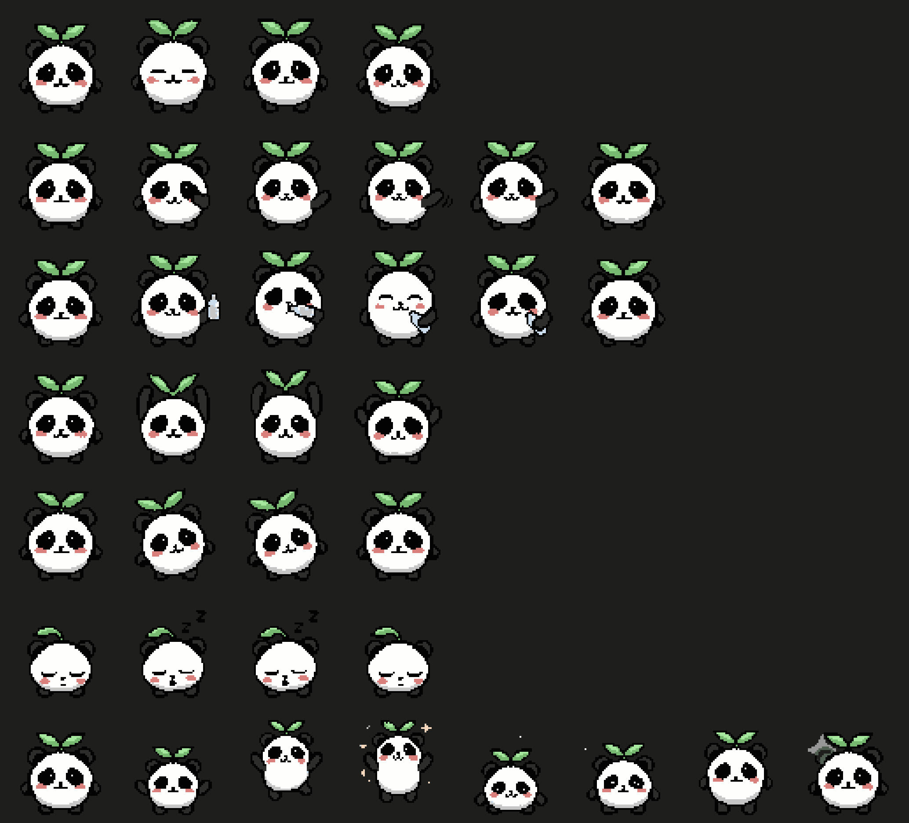

# 🐼 Pandy

**A cute panda who reminds you to stand, hydrate, look away and touch grass.**

Fully offline. No account, no sync, no telemetry.

---

Pandy sits quietly in your status bar and nudges you now and then. That's it.

| Reminder | Default |
|---|---|
| 💧 Drink water | every 2 hours |
| 🧍 Stand and stretch | every 90 minutes |
| 👀 Look away from the screen | every 30 minutes |
| 🌱 Take a break outside | every 4 hours |

Quiet hours run 8 PM – 8 AM by default, sound is off, and every interval is
nudged by ±5 minutes so Pandy never feels like a metronome.

## Pandy will never guilt you

No shame, no "you broke your streak", no health claims, no red badges counting
what you missed. Pandy has no opinion about your last four hours and is simply
pleased to see you.

Pick from three tones — **low-key** (plain language, no slang or emoji),
**Gen Z**, or **chaotic** — or write your own messages.

## No backlog, ever

Close your laptop for three hours and you will not come back to a stack of
missed reminders. At most one fires; the rest quietly reschedule. Reminders
never arrive during quiet hours, outside your active window, or on a day you
said you weren't working.

## Commands

| Command | What it does |
|---|---|
| `Sprout Panda: Take Break Now` | Trigger a reminder immediately |
| `Sprout Panda: Pause` | Hold reminders for 30 min, 1 h, 2 h, or the rest of the day |
| `Sprout Panda: Resume` | Start again |
| `Sprout Panda: Open Settings` | Settings, onboarding and animation preview |
| `Sprout Panda: Reset Schedule` | Start every timer over from now |

## The mascot

Eight hand-cut pixel-art loops on a 64×64 transparent canvas, rendered with
`image-rendering: pixelated` at whole-number scales so the art stays crisp.
Turn animation off entirely, or enable **reduced motion** for a single still
frame — Pandy also honours your OS reduced-motion setting on its own.

## Using the desktop app too?

Pandy also ships as a desktop tray app with an optional always-on-top widget.
Install both and **you will never get the same reminder twice** — the
`pandy.deliveryOwner` setting decides which one speaks, and the extension steps
aside automatically while the desktop app is running. The status bar stays put
either way.

If the desktop app is closed or uninstalled, reminders fall back to VS Code
rather than going silent.

## Accessibility

- Reduced-motion support, both as a setting and via your OS preference
- Settings panel is fully keyboard navigable with visible focus rings
- Screen-reader labels on the status bar and mascot
- Inherits your theme, including the high-contrast themes
- No state is communicated by colour alone
- Sound is off by default

## Privacy

Pandy stores your settings, the next reminder time, pause expiry, a local count
of breaks taken, and which messages it showed recently — so it doesn't repeat
itself. That's the whole list.

It never reads your files, your code, your workspace contents or your browsing
history. It makes no network requests. There is no telemetry — not "disabled by
default", **absent**.

## Settings

Everything is under `pandy.*` in your settings, or in the panel via
`Sprout Panda: Open Settings`. Intervals, working days, active hours, quiet
hours, snooze length, daily limit, randomisation, focus duration, cooldown,
tone, custom messages, mascot size, animation and where notifications appear.

## License

[MIT](LICENSE) © 2026 Shravani Nikam
